

  

# 📘 BUKU PANDUAN PENGGUNA (USER MANUAL)
## Sistem Informasi Kependudukan Desa Kedungsumur (SID)

  <b>Kuliah Kerja Nyata (KKN) Kelompok 17</b> 
  <b>Fakultas Ilmu Komputer (FILKOM) — Universitas Nahdlatul Ulama Sidoarjo (UNUSIDA)</b> 
  <i>Bekerjasama dengan Pemerintah Desa Kedungsumur, Kecamatan Krembung, Kabupaten Sidoarjo</i> 
  <b>Tahun 2026</b>

---

## 📑 Daftar Isi
1. [Pendahuluan & Gambaran Umum Sistem](#1-pendahuluan--gambaran-umum-sistem)
2. [Akses Sistem & Panduan Masuk (Login)](#2-akses-sistem--panduan-masuk-login)
3. [Navigasi & Tata Letak Antarmuka (Layout)](#3-navigasi--tata-letak-antarmuka-layout)
4. [Dashboard & Statistik Demografi Desa](#4-dashboard--statistik-demografi-desa)
   - 4.1. Kartu Ringkasan Data (KPI Cards)
   - 4.2. Grafik Komposisi Demografi & Kependudukan
   - 4.3. Filter Wilayah RT/RW Realtime
   - 4.4. Unduh Laporan Statistik Format PDF
5. [Modul Manajemen Data Penduduk](#5-modul-manajemen-data-penduduk)
   - 5.1. Melihat Daftar Penduduk & Fitur Pencarian
   - 5.2. Menambahkan Data Penduduk Baru (Lengkap & Pasfoto)
   - 5.3. Melihat Profil Detail Penduduk
   - 5.4. Mengubah / Mengedit Data Penduduk
   - 5.5. Menghapus Data Penduduk
   - 5.6. Ekspor Data Penduduk ke Excel (.xlsx)
   - 5.7. Impor Data Penduduk Massal dari Excel
6. [Modul Manajemen Kartu Keluarga (KK)](#6-modul-manajemen-kartu-keluarga-kk)
   - 6.1. Melihat Daftar Kartu Keluarga & Pencarian
   - 6.2. Menambahkan Data Kartu Keluarga Baru
   - 6.3. Melihat Rincian Susunan Anggota Keluarga (Detail KK)
   - 6.4. Mengubah Data & Susunan Anggota KK
   - 6.5. Menghapus Data Kartu Keluarga
   - 6.6. Ekspor Data Kartu Keluarga ke Excel
7. [Modul Manajemen Pengguna & Hak Akses (Khusus Administrator)](#7-modul-manajemen-pengguna--hak-akses-khusus-administrator)
   - 7.1. Melihat Daftar Akun Petugas / Pengguna
   - 7.2. Menambahkan Akun Pengguna / Operator Baru
   - 7.3. Mengedit Profil & Peran Hak Akses Pengguna
   - 7.4. Mereset / Mengubah Kata Sandi Akun
   - 7.5. Memblokir & Membuka Blokir Pengguna (Ban/Unban)
   - 7.6. Menghapus Akun Pengguna
8. [Panduan Keamanan & Tips Penggunaan](#8-panduan-keamanan--tips-penggunaan)
9. [Tanya Jawab & Penyelesaian Masalah (FAQ)](#9-tanya-jawab--penyelesaian-masalah-faq)

---

## 1. Pendahuluan & Gambaran Umum Sistem

**Sistem Informasi Kependudukan (SID) Desa Kedungsumur** merupakan aplikasi manajemen administrasi desa modern yang dikembangkan sebagai bagian dari program pengabdian masyarakat oleh mahasiswa **Kuliah Kerja Nyata (KKN) Kelompok 17 Fakultas Ilmu Komputer (FILKOM) Universitas Nahdlatul Ulama Sidoarjo (UNUSIDA)** bekerjasama dengan **Pemerintah Desa Kedungsumur**. Aplikasi ini dirancang untuk mempermudah aparatur desa, administrator, dan staf operator dalam mencatat, memperbarui, memvalidasi, serta menyajikan data demografi kependudukan secara akurat, terstruktur, dan aman.

### Keunggulan Utama Sistem:
- **Keamanan Data Mutakhir:** NIK (Nomor Induk Kependudukan) dan Nomor Kartu Keluarga (KK) dilindungi enkripsi standar militer **AES-256-GCM** serta teknik *Blind Indexing* untuk mencegah kebocoran data sensitif warga.
- **Penyimpanan Pasfoto Terintegrasi:** Berkas pasfoto warga disimpan secara aman pada *Object Storage* (MinIO S3) dengan optimasi performa tinggi.
- **Visualisasi Statistik Cerdas:** Menampilkan grafik distribusi usia, rasio jenis kelamin, kepadatan penduduk per RT, status pernikahan, pekerjaan, dan agama secara interaktif.
- **Ekspor & Impor Excel Cepat:** Memudahkan integrasi data lama atau pelaporan berkala melalui format spreadsheet.
- **Ekspor Laporan PDF Sekali Klik:** Menghasilkan dokumen laporan demografi resmi desa yang siap cetak kapan saja.

---

## 2. Akses Sistem & Panduan Masuk (Login)

Untuk mengakses sistem, buka peramban web (Google Chrome, Mozilla Firefox, Microsoft Edge, atau Safari) dan akses alamat web aplikasi:
`http://localhost:3000` (atau domain resmi yang disediakan pemerintah desa).

### 2.1 Halaman Login
Saat pertama kali membuka aplikasi, Anda akan diarahkan ke halaman login yang bersih dan responsif.

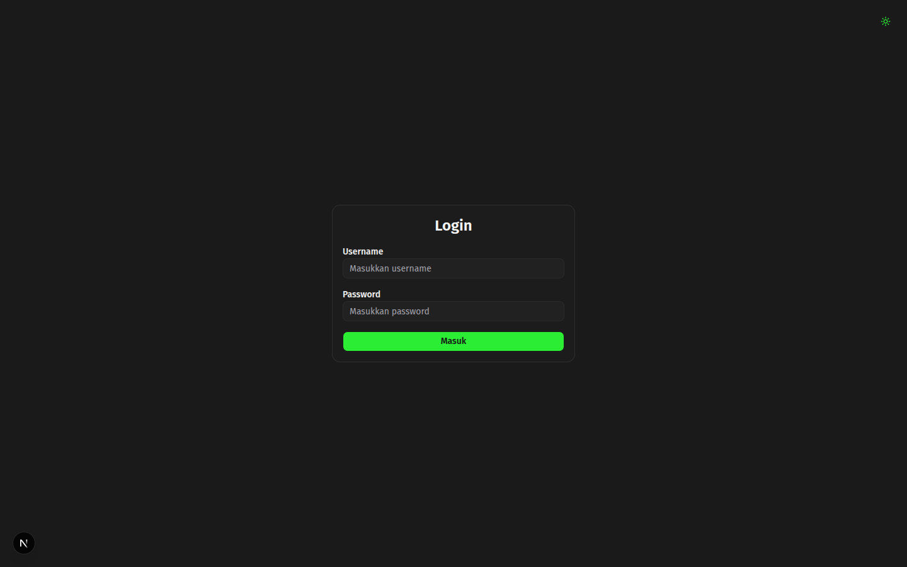

### 2.2 Langkah-langkah Masuk:
1. Masukkan **Username** akun Anda (contoh: `admin` atau username yang telah didaftarkan).
2. Masukkan **Password** akun Anda.
3. Klik tombol **"Masuk"**.

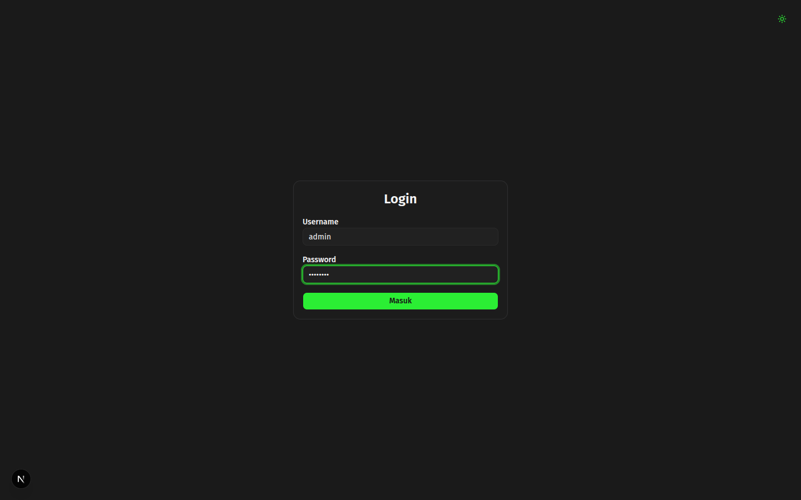

> **Catatan Keamanan:**
> - Pastikan tidak membagikan kata sandi Anda kepada pihak yang tidak berkepentingan.
> - Sistem akan secara otomatis mengarahkan Anda ke halaman **Dashboard** atau **Data Penduduk** setelah autentikasi berhasil.

---

## 3. Navigasi & Tata Letak Antarmuka (Layout)

Sistem menggunakan tata letak modern yang terdiri dari:
1. **Sidebar Menu (Sisi Kiri):**
   - **Logo & Nama Instansi:** Kependudukan Desa Kedungsumur.
   - **Dashboard:** Statistik demografi desa dan ekspor laporan PDF.
   - **Penduduk:** Manajemen data individual warga, pasfoto, dan pencarian NIK.
   - **Kartu Keluarga:** Manajemen data KK, kepala keluarga, dan hubungan anggota keluarga.
   - **Pengguna:** Manajemen akun petugas/operator sistem (khusus role Administrator).
   - **Panel Akun & Tombol Keluar (Logout):** Menampilkan nama pengguna yang sedang aktif dan tombol keluar sistem secara aman.
2. **Top Navigation Bar:**
   - Tombol **Toggle Sidebar** (untuk menyembunyikan/menampilkan menu samping).
   - Tombol **Toggle Tema** (beralih antara mode Terang/Light dan mode Gelap/Dark).
3. **Area Konten Utama:** Menampilkan tabel data, formulir isian, atau grafik analitik interaktif.

---

## 4. Dashboard & Statistik Demografi Desa

Halaman **Dashboard** menyajikan ringkasan visual mengenai kondisi demografi seluruh warga Desa Kedungsumur secara *real-time*.

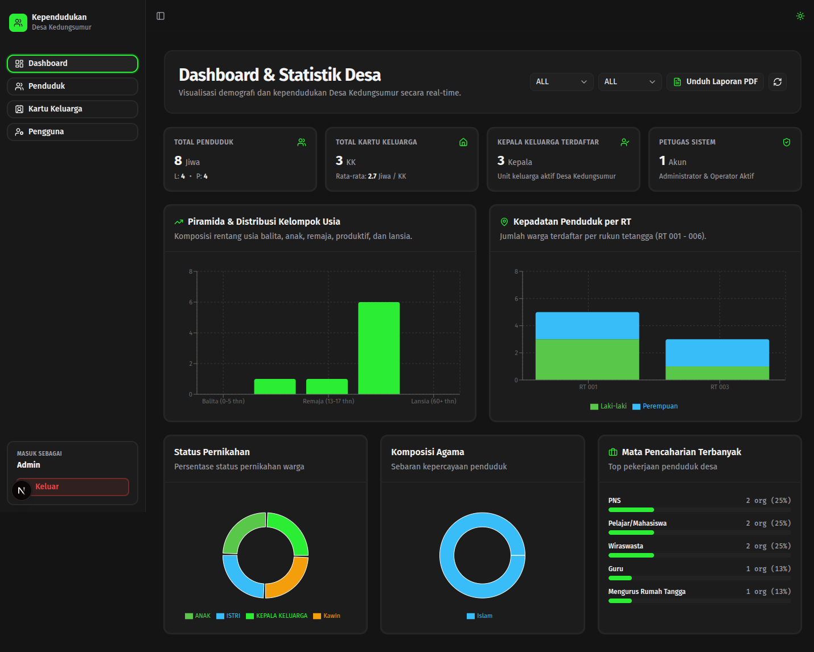

### 4.1 Kartu Ringkasan Indikator (KPI Cards)
Pada bagian atas dashboard terdapat 4 kartu indikator utama:
- **Total Penduduk:** Menampilkan jumlah total seluruh jiwa yang terdaftar beserta perincian jumlah **Laki-laki (L)** dan **Perempuan (P)**.
- **Total Kartu Keluarga:** Menampilkan jumlah kepala keluarga/KK aktif serta nilai **Rata-rata Jiwa per KK**.
- **Kepala Keluarga Terdaftar:** Menampilkan total unit keluarga yang tercatat.
- **Petugas Sistem:** Menampilkan jumlah akun staf operator dan administrator yang memiliki akses ke aplikasi.

### 4.2 Grafik Analitik Demografi
Dashboard dilengkapi visualisasi grafik yang interaktif:
1. **Piramida & Distribusi Kelompok Usia:** Menampilkan pengelompokan usia warga (Balita 0-5 thn, Anak-anak 6-12 thn, Usia Produktif 18-59 thn, Lansia 60+ thn).
2. **Kepadatan Penduduk per RT:** Diagram batang jumlah warga yang terbagi berdasarkan RT (misal RT 001 hingga RT 006) lengkap dengan proporsi gender.
3. **Status Pernikahan:** Komposisi status perkawinan warga (Kawin, Belum Kawin, Cerai Hidup, Cerai Mati, dll).
4. **Komposisi Agama:** Distribusi keyakinan/agama seluruh penduduk.
5. **Mata Pencaharian Terbanyak:** Daftar 5 profesi pekerjaan paling dominan di Desa Kedungsumur.

### 4.3 Filter Wilayah RT/RW
Anda dapat memfilter seluruh tampilan statistik berdasarkan rukun tetangga tertentu:
- Pilih dropdown **RT** (contoh: `ALL`, `001`, `002`, dst).
- Pilih dropdown **RW** (contoh: `ALL`, `001`, `002`, dst).
- Klik tombol **Segarkan Data** untuk memperbarui data grafik secara instan.

### 4.4 Unduh Laporan Statistik PDF
Untuk mencetak laporan kependudukan resmi:
1. Klik tombol **"Unduh Laporan PDF"** di pojok kanan atas halaman dashboard.
2. Sistem akan mengompilasi data ringkasan dan langsung mengunduh file dokumen bernama `laporan_statistik_desa_kedungsumur.pdf`.
3. Notifikasi sukses akan muncul di sudut layar.

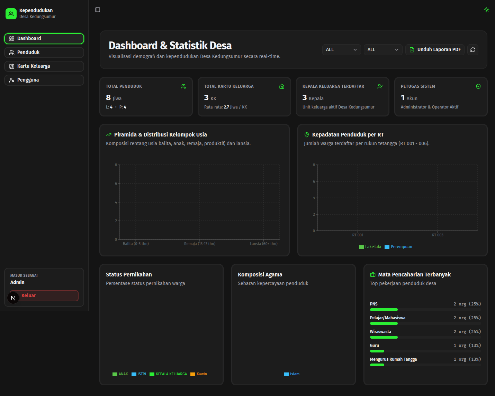

---

## 5. Modul Manajemen Data Penduduk

Modul ini digunakan untuk mengelola seluruh arsip data individu masyarakat desa.

### 5.1 Melihat Daftar Penduduk & Fitur Pencarian
Buka menu **"Penduduk"** pada sidebar untuk melihat tabel data warga.

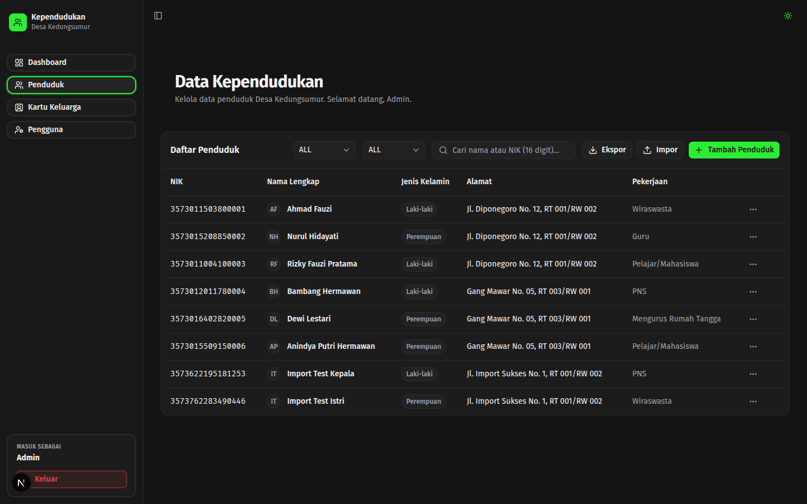

**Fitur pada Halaman Daftar Penduduk:**
- **Pencarian Cepat:** Ketik nama warga atau 16 digit NIK pada kotak pencarian *"Cari nama atau NIK..."*.
- **Filter RT & RW:** Membatasi tampilan daftar penduduk pada lingkungan RT/RW tertentu.
- **Inisial & Avatar:** Memudahkan identifikasi visual warga pada tabel.
- **Menu Aksi Baris:** Tombol titik tiga `...` di ujung kanan setiap baris untuk melakukan aksi cepat (Detail, Edit, Hapus).

---

### 5.2 Menambahkan Data Penduduk Baru

Ada dua cara mudah untuk menambahkan data warga:
1. Melalui **Modal Cepat** pada halaman daftar penduduk.
2. Melalui **Formulir Halaman Penuh** (`/kependudukan/tambah`).

#### A. Modal Input Penduduk
Klik tombol **"+ Tambah Penduduk"** di bagian atas tabel untuk memunculkan formulir cepat:

#### B. Formulir Tambah Penduduk Halaman Penuh
Untuk pengisian data kependudukan lengkap beserta upload pasfoto:

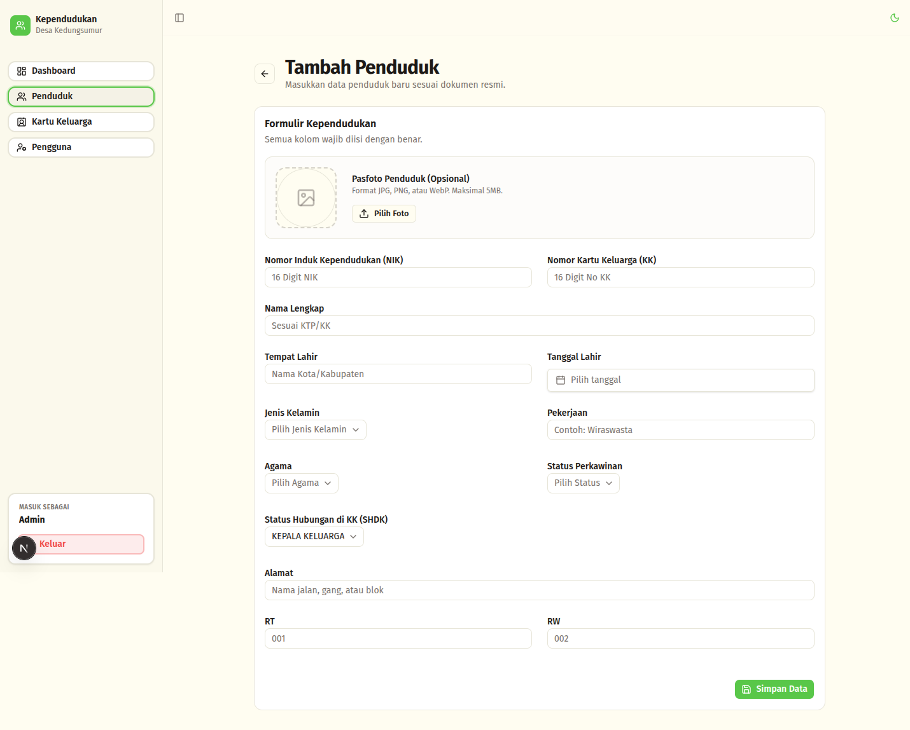

**Rincian Kolom Isian yang Wajib & Opsional:**
- **NIK (16 Digit):** Nomor Induk Kependudukan resmi (wajib unik dan valid).
- **Nomor KK (16 Digit):** Nomor Kartu Keluarga yang menaungi warga.
- **Nama Lengkap:** Nama lengkap sesuai KTP/Akta Lahir.
- **Tempat Lahir & Tanggal Lahir:** Kota/Kabupaten kelahiran dan tanggal lahir.
- **Jenis Kelamin:** Pilih `Laki-laki` atau `Perempuan`.
- **Alamat Lengkap:** Nama jalan, dusun, nomor rumah.
- **RT & RW:** Nomor RT (3 digit, misal `001`) dan RW (misal `002`).
- **Agama:** Pilihan agama resmi (Islam, Kristen Protestan, Katolik, Hindu, Buddha, Khonghucu).
- **Status Perkawinan:** Status hubungan (Belum Kawin, Kawin, Cerai Hidup, Cerai Mati).
- **Pekerjaan:** Profesi utama warga (PNS, Wiraswasta, Petani, Pelajar, dll).
- **Unggah Pasfoto:** Pilih berkas foto formal (format `.jpg`, `.png`, `.webp` maksimal 5MB).
- Klik tombol **"Simpan Data Penduduk"**.

---

### 5.3 Melihat Profil Detail Penduduk
Klik pada baris nama penduduk atau pilih opsi **"Lihat Detail"** pada menu aksi baris.

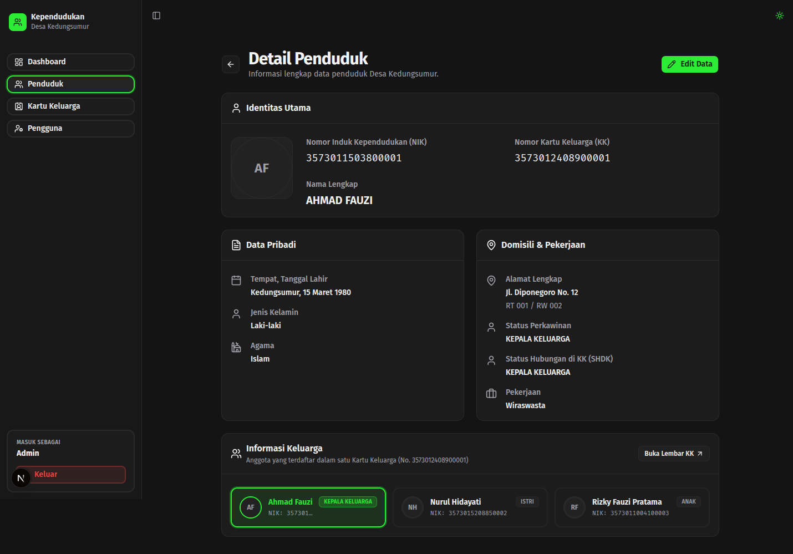

**Informasi yang Ditampilkan:**
- **Kartu Identitas Warga:** Pasfoto resmi, Nama Lengkap, NIK, dan Nomor KK terenkripsi yang telah didekripsi aman.
- **Data Demografi:** Tempat & tanggal lahir, usia terkini, jenis kelamin, dan agama.
- **Alamat & Domisili:** Alamat lengkap, RT, RW, dan Dusun.
- **Status Sosial & Pekerjaan:** Status perkawinan serta pekerjaan saat ini.
- **Tombol Aksi Cepat:** Tombol *Kembali*, *Edit Data*, dan *Hapus Data*.

---

### 5.4 Mengubah / Mengedit Data Penduduk
Untuk memperbarui data warga yang mengalami perubahan (misal: pindah alamat RT, perubahan status perkawinan, atau perbaruan pasfoto):
1. Buka halaman detail penduduk atau klik menu `...` -> **"Edit"**.
2. Anda akan diarahkan ke formulir edit penduduk.

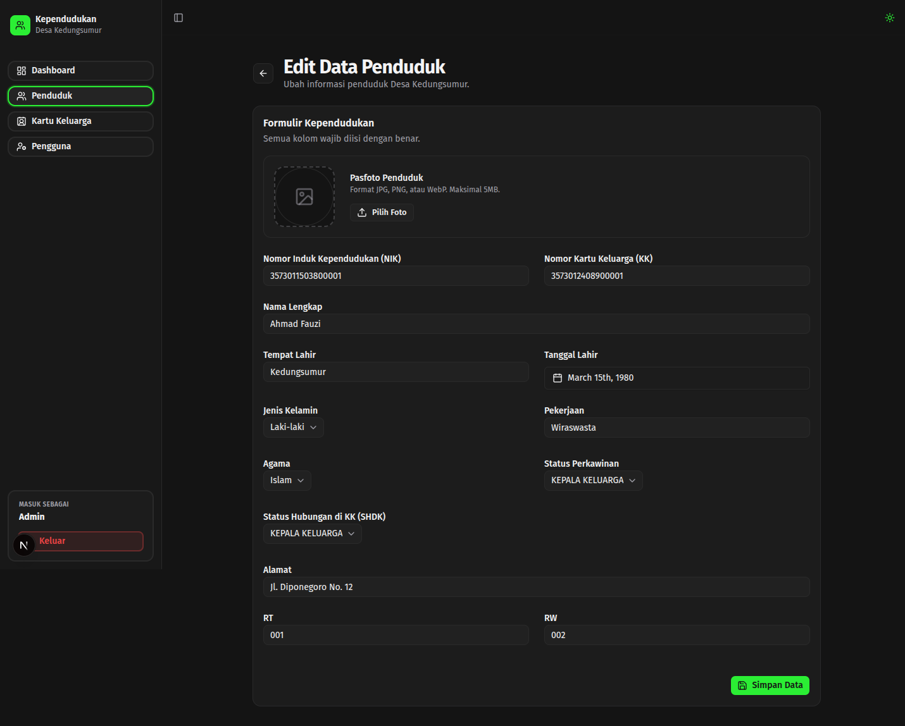

3. Ubah kolom data yang diinginkan.
4. Anda dapat mengganti pasfoto dengan mengunggah foto baru (foto lama di Object Storage akan diperbarui secara otomatis).
5. Klik **"Simpan Perubahan"**.

---

### 5.5 Menghapus Data Penduduk
1. Pada menu aksi baris atau halaman detail penduduk, klik tombol **"Hapus"** (ikon tempat sampah merah).
2. Sistem akan menampilkan **Dialog Konfirmasi Penghapusan** untuk mencegah penghapusan yang tidak sengaja.

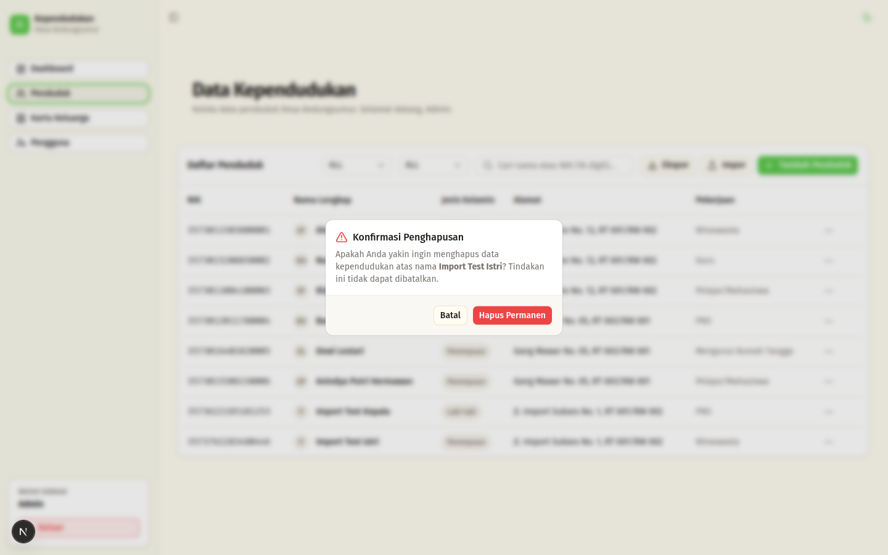

3. Baca pesan peringatan dengan teliti.
4. Klik **"Ya, Hapus Data"** untuk menghapus data permanen, atau klik **"Batal"** untuk membatalkan.

---

### 5.6 Ekspor Data Penduduk ke Excel (.xlsx)
1. Buka halaman **Data Penduduk**.
2. Klik tombol **"Ekspor"** di bagian atas tabel.
3. Peramban web akan langsung mengunduh file spreadsheet `.xlsx` berisi seluruh data penduduk lengkap dengan status dan alamat domisili.

---

### 5.7 Impor Data Penduduk Massal dari Excel
Jika Anda memiliki data kependudukan dalam jumlah ratusan atau ribuan dari aplikasi lama:
1. Klik tombol **"Impor"** di halaman data penduduk.
2. Jendela modal **Impor Data Penduduk dari Excel** akan terbuka.

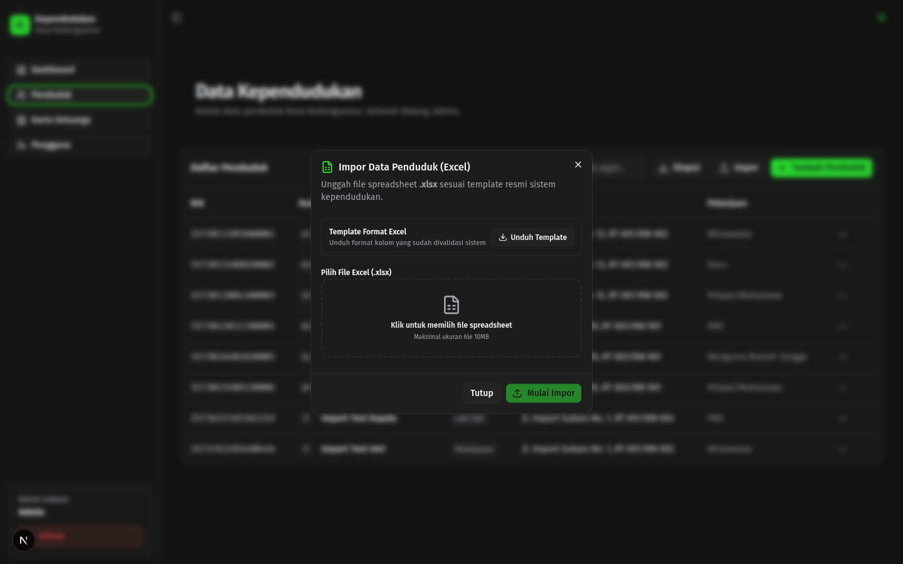

3. **Unduh Template:** Klik tautan *"Unduh format template Excel"* jika Anda belum memiliki format tabel yang sesuai.
4. **Pilih File Excel:** Klik area unggah berkas dan pilih file `.xlsx` dari komputer Anda.
5. Klik **"Unggah & Proses Impor"**.
6. Sistem akan memvalidasi data dan menginput seluruh warga sekaligus ke dalam database.

---

## 6. Modul Manajemen Kartu Keluarga (KK)

Modul **Kartu Keluarga** digunakan untuk mengelola data unit keluarga dan susunan hubungan anggota keluarga.

### 6.1 Melihat Daftar Kartu Keluarga & Pencarian
Akses menu **"Kartu Keluarga"** dari sidebar kiri.

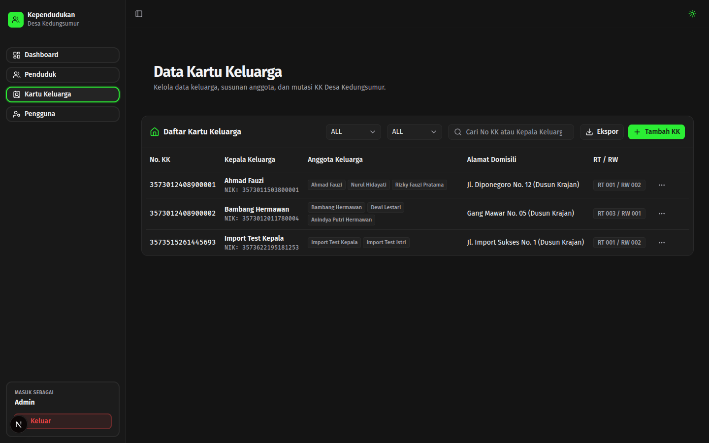

**Kolom Informasi Kartu Keluarga:**
- **No. KK:** Nomor 16 digit Kartu Keluarga.
- **Kepala Keluarga:** Nama Kepala Keluarga beserta NIK-nya.
- **Anggota Keluarga:** Daftar lencana nama seluruh anggota keluarga yang terdaftar dalam KK tersebut.
- **Alamat Domisili:** Dusun dan alamat tempat tinggal keluarga.
- **RT / RW:** Wilayah RT dan RW domisili.
- **Menu Aksi Baris:** Pilihan Detail KK, Edit KK, dan Hapus KK.

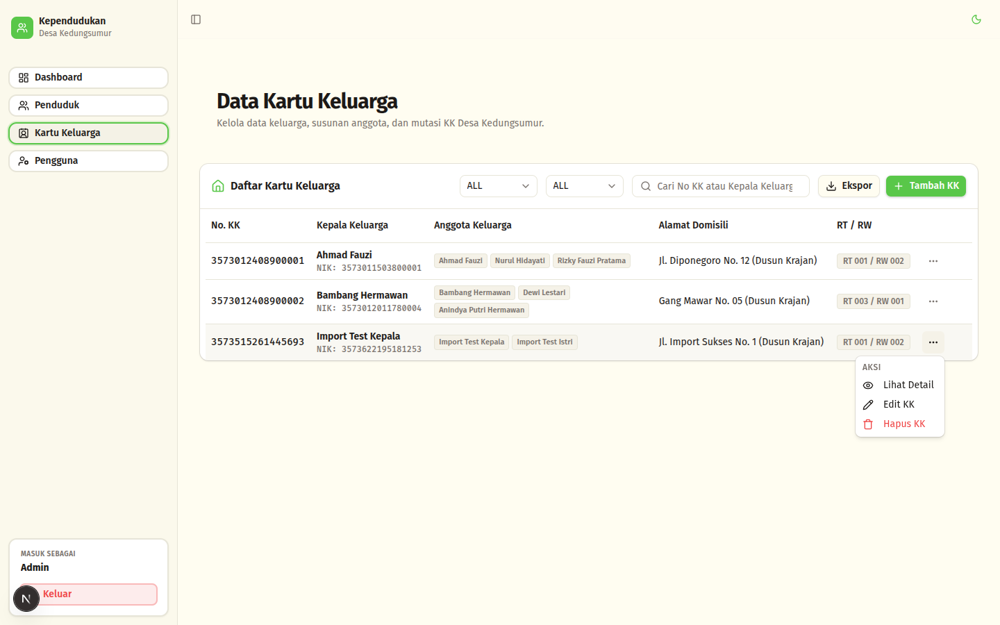

---

### 6.2 Menambahkan Data Kartu Keluarga Baru
1. Klik tombol **"+ Tambah KK"** di sudut kanan atas daftar KK.
2. Halaman formulir penambahan KK akan terbuka.

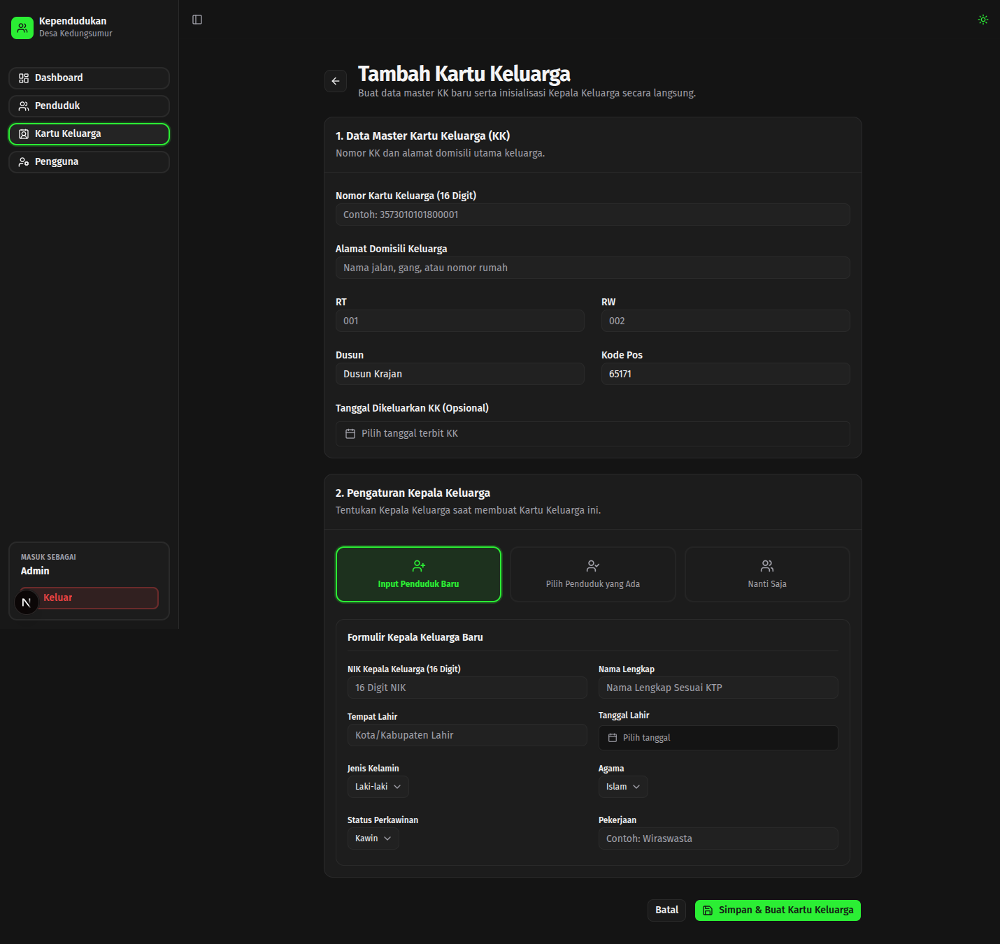

3. Masukkan **Nomor KK (16 digit)**.
4. Pilih **Kepala Keluarga** dari daftar penduduk yang terdaftar.
5. Tentukan **Alamat Domisili, Dusun, RT, dan RW**.
6. Pilih warga yang menjadi **Anggota Keluarga** serta tentukan status hubungannya (Istri, Anak, Orang Tua, Famili Lain).
7. Klik **"Simpan Kartu Keluarga"**.

---

### 6.3 Melihat Rincian Susunan Anggota Keluarga (Detail KK)
Klik pada salah satu baris KK untuk membuka kartu keluarga elektronik resmi:

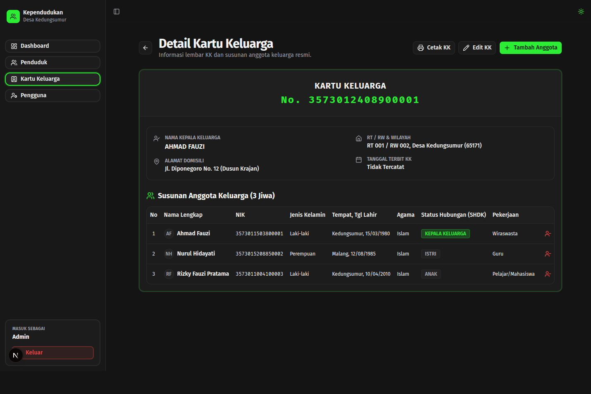

**Informasi yang Ditampilkan:**
- **Kop Kartu Keluarga:** Nomor KK, Nama Kepala Keluarga, Alamat, RT/RW, Dusun, Desa Kedungsumur, Kecamatan, dan Kabupaten.
- **Tabel Susunan Anggota Keluarga:** Menampilkan No urut, Nama Lengkap, NIK, Jenis Kelamin, Tempat & Tgl Lahir, Agama, Pekerjaan, dan Hubungan Keluarga.

---

### 6.4 Mengubah Data & Susunan Anggota KK
Jika terjadi kelahiran anak baru, mutasi anggota keluarga, atau perubahan alamat:
1. Pada menu aksi KK, pilih **"Edit"**.
2. Halaman edit KK akan menampilkan data yang sudah ada sebelumnya.

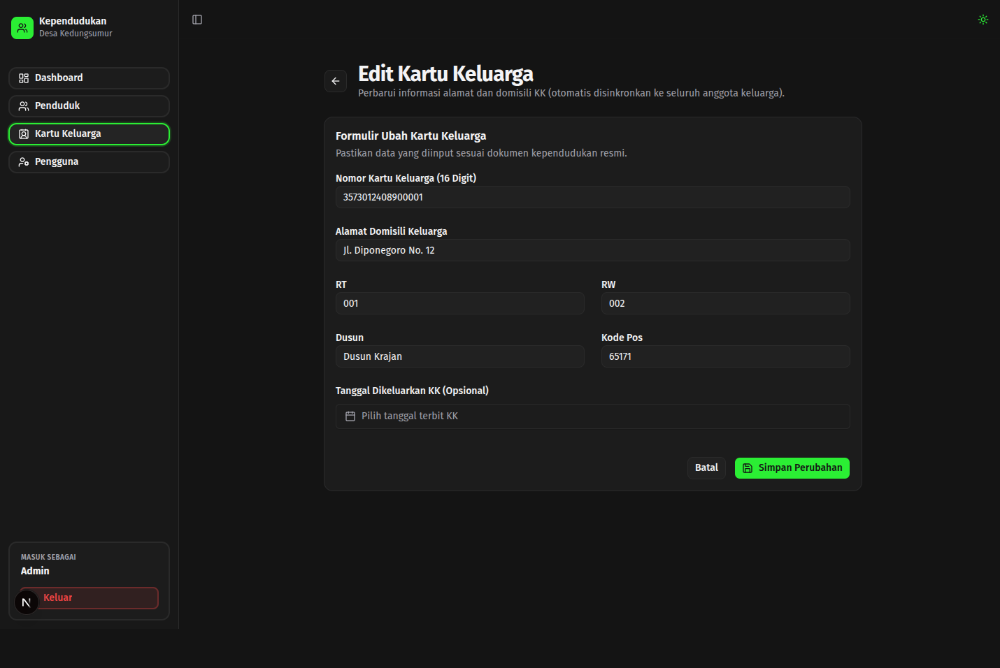

3. Anda dapat menambah atau mengurangi anggota keluarga, memperbarui alamat, atau mengganti Kepala Keluarga.
4. Klik **"Simpan Perubahan"**.

---

### 6.5 Menghapus Data Kartu Keluarga
1. Klik tombol menu titik tiga `...` pada baris KK yang ingin dihapus -> Pilih **"Hapus"**.
2. Dialog peringatan akan muncul:

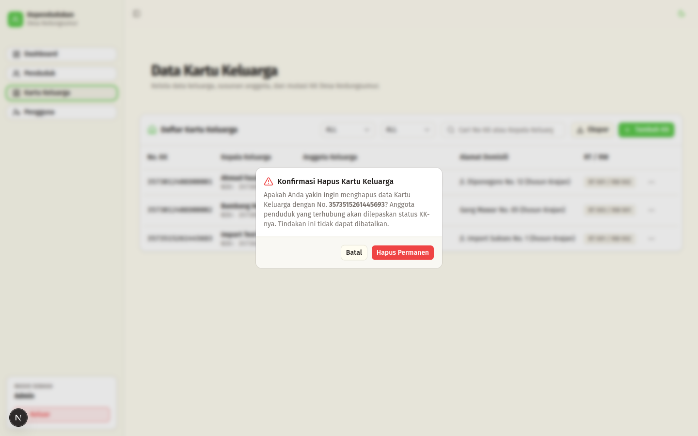

3. Klik **"Hapus Kartu Keluarga"** untuk mengonfirmasi.

---

### 6.6 Ekspor Data Kartu Keluarga ke Excel
Klik tombol **"Ekspor"** pada halaman Kartu Keluarga untuk mengunduh rekapitulasi data keluarga desa dalam format file `.xlsx`.

---

## 7. Modul Manajemen Pengguna & Hak Akses (Khusus Administrator)

Modul ini hanya dapat diakses oleh akun dengan tingkat wewenang **Administrator**.

### 7.1 Melihat Daftar Akun Pengguna
Buka menu **"Pengguna"** pada sidebar untuk melihat seluruh akun yang memiliki akses ke sistem.

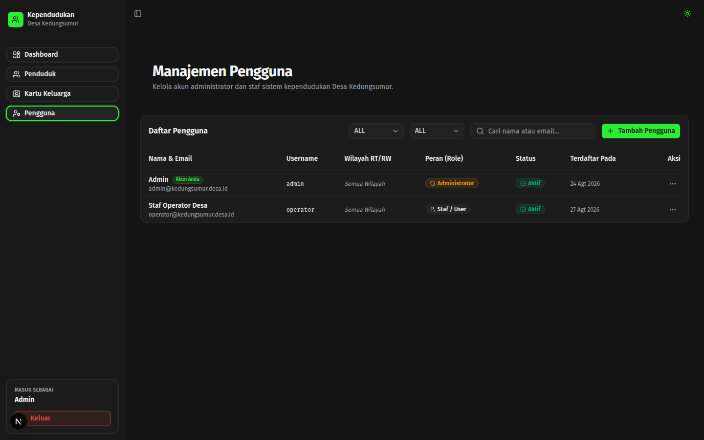

**Informasi pada Tabel Pengguna:**
- **Nama & Email:** Nama lengkap petugas dan alamat email aktif.
- **Username:** ID login petugas.
- **Wilayah Penugasan:** `Semua Wilayah` (Admin) atau terbatas pada `RT/RW tertentu`.
- **Peran (Role):** `Administrator` (Akses Penuh) atau `Staf / User` (Operator Input).
- **Status:** `Aktif` (Hijau) atau `Diblokir / Banned` (Merah).
- **Terdaftar Pada:** Tanggal pembuatan akun.

---

### 7.2 Menambahkan Akun Pengguna Baru
1. Klik tombol **"+ Tambah Pengguna"**.
2. Isi formulir pembuatan akun baru:

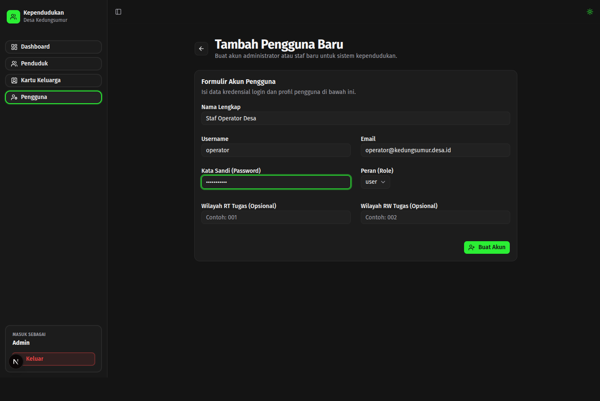

3. **Data yang Diisi:**
   - **Nama Lengkap:** Nama petugas (contoh: *Staf Operator Desa*).
   - **Username:** Username unik untuk login (contoh: *operator*).
   - **Email:** Email resmi dinas / pribadi aktif.
   - **Password:** Kata sandi awal akun minimal 6 karakter.
   - **Role / Peran:** Pilih `Administrator` atau `Staf / Operator (User)`.
   - **Wilayah RT/RW Tugas (Opsional):** Batasan wilayah kerja operator jika diperlukan.
4. Klik tombol **"Tambah Pengguna"**.

---

### 7.3 Mengedit Profil & Peran Hak Akses Pengguna
1. Klik tombol titik tiga `...` pada baris pengguna -> Pilih **"Edit & Kelola"**.

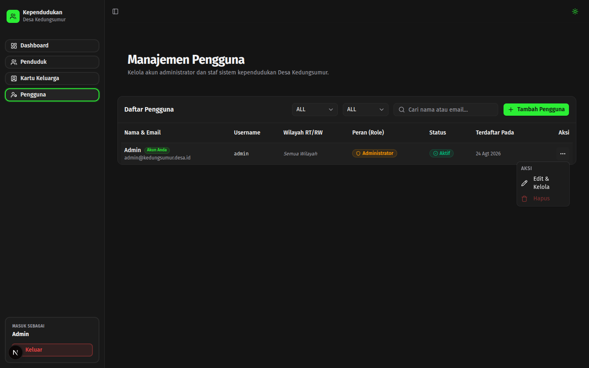

2. Halaman pengelolaan akun pengguna akan terbuka:

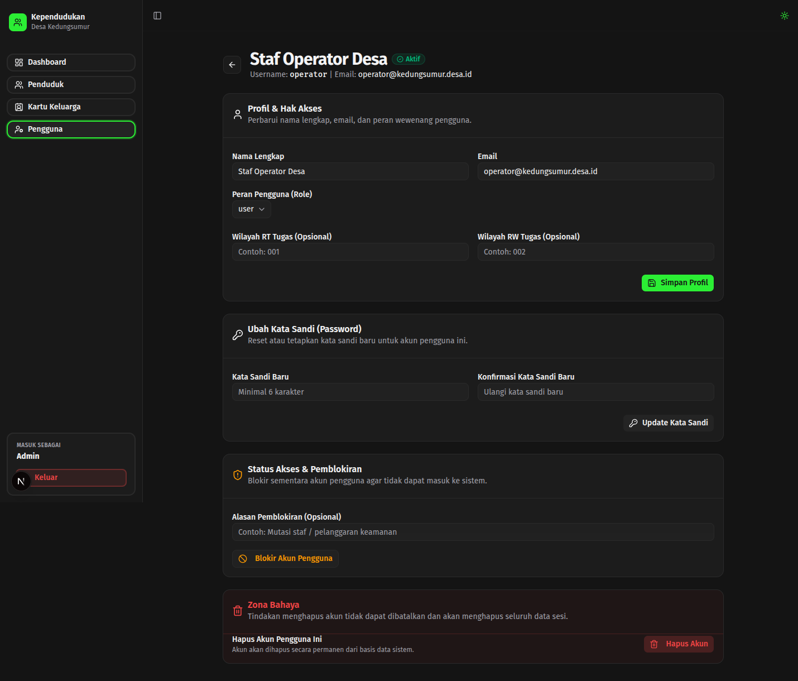

3. Pada panel **Profil & Hak Akses**, Anda dapat memperbarui nama, email, role, serta wilayah tugas RT/RW.
4. Klik **"Simpan Profil"**.

---

### 7.4 Mereset / Mengubah Kata Sandi Akun
Jika petugas lupa kata sandi atau diperlukan rotasi keamanan:
1. Pada halaman kelola pengguna, scroll ke panel **"Ubah Kata Sandi (Password)"**.
2. Masukkan **Kata Sandi Baru** (minimal 6 karakter).
3. Masukkan **Konfirmasi Kata Sandi Baru**.
4. Klik tombol **"Update Kata Sandi"**.

---

### 7.5 Memblokir & Membuka Blokir Pengguna (Ban / Unban)
Untuk menonaktifkan akun sementara (misal staf sedang cuti atau mutasi tugas):
1. Pada panel **"Status Akses & Pemblokiran"**, masukkan alasan pemblokiran (opsional).
2. Klik tombol merah **"Blokir Akun Pengguna"**.
3. Status akun akan berubah menjadi *Diblokir* dan pengguna tidak dapat melakukan login ke sistem.
4. Untuk membuka kembali akses, klik tombol **"Buka Blokir Akun"**.

---

### 7.6 Menghapus Akun Pengguna Secara Permanen
1. Pada panel **"Zona Bahaya"**, klik tombol **"Hapus Akun"**.
2. Dialog konfirmasi penghapusan akun akan muncul:

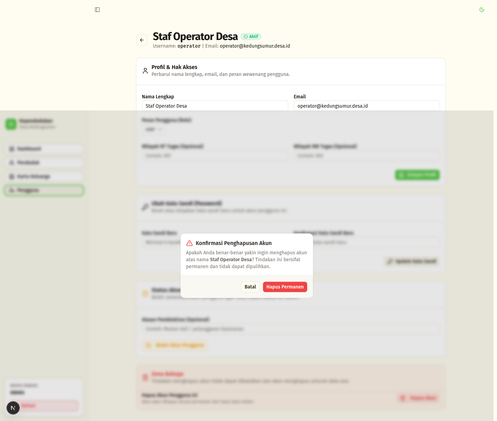

3. Klik **"Ya, Hapus Akun"** untuk menghapus akun dan seluruh sesi aktifnya secara permanen.

---

## 8. Panduan Keamanan & Tips Penggunaan

1. **Selalu Logout Setelah Selesai Bertugas:**
   Gunakan tombol **"Keluar"** di pojok kiri bawah sidebar sebelum meninggalkan komputer kerja untuk mengakhiri sesi aktif secara aman.
2. **Kombinasi Kata Sandi Kuat:**
   Gunakan perpaduan huruf besar, huruf kecil, angka, dan simbol untuk akun administrator maupun operator.
3. **Format NIK & KK Sesuai Standar Dukcapil:**
   Pastikan NIK dan No KK terdiri dari tepat **16 digit angka numerik**.
4. **Kualitas Pasfoto Penduduk:**
   Gunakan pasfoto formal dengan latar belakang polos (merah/biru), rasio standar 3:4 atau 4:6, dengan ukuran file di bawah 5MB agar tampilan kartu identitas jernih dan tajam.
5. **Cadangan Data Berkala:**
   Lakukan ekspor data ke Excel secara rutin setiap akhir minggu/bulan untuk arsip cadangan luring (offline backup).

---

## 9. Tanya Jawab & Penyelesaian Masalah (FAQ)

### Q1: Mengapa sistem menolak saat saya memasukkan NIK baru?
> **Jawaban:** NIK bersifat unik perorangan. Periksa apakah NIK tersebut sudah pernah diinput sebelumnya oleh petugas lain. Anda dapat mencarinya terlebih dahulu di kotak pencarian Data Penduduk.

### Q2: Mengapa pasfoto yang saya upload tidak muncul?
> **Jawaban:** Pastikan format foto adalah `.jpg`, `.jpeg`, `.png`, atau `.webp` dan ukurannya tidak melebihi 5 MB. Pastikan juga koneksi ke storage server MinIO dalam keadaan aktif.

### Q3: Siapa yang dapat melihat menu "Pengguna"?
> **Jawaban:** Menu Pengguna hanya dapat diakses oleh akun dengan tingkat peran (*role*) **Administrator**. Akun dengan role *User/Staf* tidak memiliki hak akses untuk mengelola akun petugas lain.

### Q4: Bagaimana cara mencetak kartu keluarga atau laporan demografi?
> **Jawaban:** Untuk laporan demografi seluruh desa, buka halaman **Dashboard** dan klik **"Unduh Laporan PDF"**. Untuk rincian data KK, buka halaman **Detail KK** dan Anda dapat mencetaknya langsung melalui fitur cetak browser (`Ctrl + P` / `Cmd + P`).

---

*Buku Panduan Pengguna — Sistem Informasi Kependudukan Desa Kedungsumur v1.0*  
*Disusun oleh Tim KKN Kelompok 17 — Fakultas Ilmu Komputer (FILKOM) — Universitas Nahdlatul Ulama Sidoarjo (UNUSIDA)*  
*Bekerjasama dengan Pemerintah Desa Kedungsumur © 2026. Hak Cipta Dilindungi Undang-Undang.*
